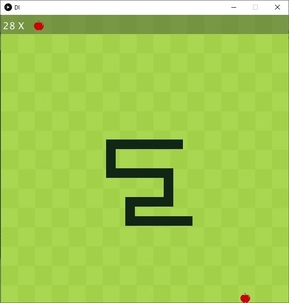

# Snake Game
**Autor:** Yann Ewo
## Kurzbeschreibung
**Snake** ist ein Spiel, dessen Prinzip einfach darin besteht, so viele Früchte wie möglich zu essen. Genauer gesagt geht es um eine Schlange, deren Ziel es ist, durch den Verzehr von Früchten, die überall auf dem Spielplatz auftauchen, so lange wie möglich zu werden. Dazu muss die Schlange vermeiden, gegen die Ränder des Feldes und gegen sich selbst zu stoßen, sonst ist es **GAMEOVER**.
## Screenshot

 

## Bedienungshinweise
Die Steuerung der Schlange ist relativ einfach und erfolgt mit den folgenden Tasten:
<kbd>&uarr;</kbd> : Bewegung nach **Oben**
<kbd>&darr;</kbd>  : Bewegung nach **Unten**
<kbd>&larr;</kbd> : Bewegung nach **Links**
<kbd>&rarr;</kbd> : Bewegung nach **Recht**
und <kbd>Enter</kbd> für das Starten und Neustarten des Spiels.

## Dateiübersicht und Lines of Code
~~~
\pic2.jpg
\pic3.jpg
\README.md.txt
\app\build.gradle
\app\core.jar
\app\javamp3.jar
\app\jsyn.jar
\app\sound.jar
\app\src\main\java\processpack\AL.java
\app\src\main\java\processpack\App.java
\app\src\main\java\processpack\DI.java
\app\src\main\java\processpack\Dynamics.java
\app\src\main\resources\apple.png
\app\src\main\resources\collision.wav
\app\src\main\resources\eat.wav
\app\src\main\resources\Feld.png
\app\src\main\resources\game.wav
\app\src\test\java\processpack\AppTest.java
-------------------------------------------------------------------------------
Language                     files          blank        comment           code
-------------------------------------------------------------------------------
Java                             5            130             58            473
HTML                             3              0              0            357
CSS                              2             49              0            214
JavaScript                       1             45              1            148
Bourne Shell                     1             23             36            126
DOS Batch                        1             21              2             66
Gradle                           2              9             23             22
XML                              1              0              0             12
-------------------------------------------------------------------------------
SUM:                            16            277            120           1418
-------------------------------------------------------------------------------
~~~
## Verwendete Quellen
* https://processing.org/reference  (Abruf, 20.06.2021)
* https://drive.google.com/file/d/1kYmFtx-mALCyR1FSVfQ6RgzbIrv4Sa-M/view  (Abruf, 14.06.2021)
* https://docs.gradle.org/7.1-rc-2/userguide/userguide.html (Abruf, 05.07.2021)
* https://moodle.thm.de/pluginfile.php/346072/mod_resource/content/2/solution.java (Abruf, 20.06.2021)
* https://www.google.com/fbx?fbx=snake_arcade (Abruf, 20.06.2021)
* https://stackoverflow.com/questions/68132283/generate-a-point-object-randomly-excluding-certain-values (Abruf, 25.06.2021)
* https://www.tutorialspoint.com/use-iterator-to-remove-an-element-from-a-collection-in-java (Abruf, 30.06.2021)
